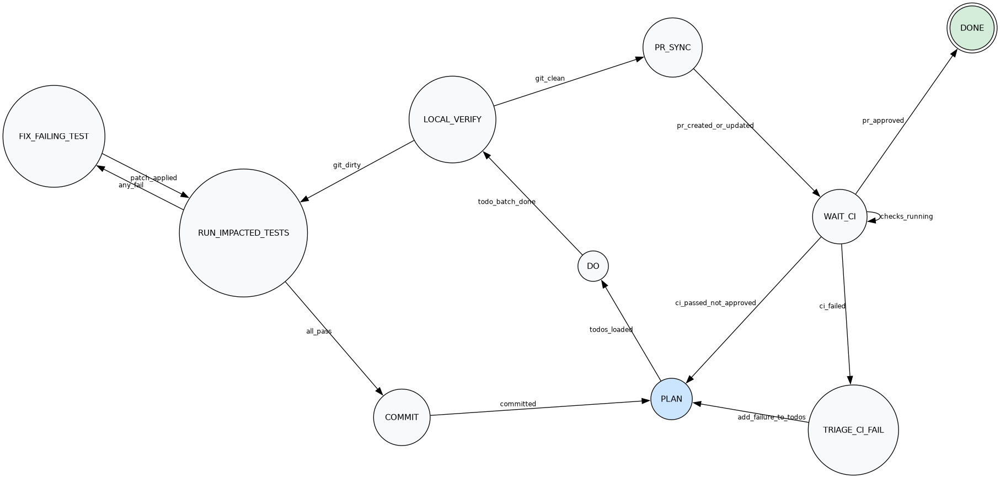

# falsify

AI coding agent test loop for scientific hypothesis testing.

`falsify` is a minimal FSM orchestrator that drives an AI coding agent through a continuous improvement loop: plan → do → test → fix → commit → PR → CI → repeat.

## State Machine



| State | Description |
|---|---|
| `PLAN` | Load pending todos (review comments, CI failures, backlog) |
| `DO` | Execute todos; the agent modifies the working tree |
| `LOCAL_VERIFY` | Check git status; route to tests if dirty, PR sync if clean |
| `RUN_IMPACTED_TESTS` | Run pytest on tests affected by changed files |
| `FIX_FAILING_TEST` | Agent fixes one failing test at a time |
| `COMMIT` | Commit clean working tree to feature branch |
| `PR_SYNC` | Push branch and create/update PR against `dev` |
| `WAIT_CI` | Poll GitHub checks and review status |
| `TRIAGE_CI_FAIL` | Convert CI failure logs into actionable todos |
| `DONE` | PR approved; cycle complete |

## Usage

```python
from falsify import AgentFSM, Context

fsm = AgentFSM()
fsm.run()
```

## Development

```bash
# Run tests
make test

# Generate state machine diagram
make docs
```

## TODOs
- HTTP live state observer
- test suite
- doctor helper
- all cli integration and docs
- prompts for LLMs